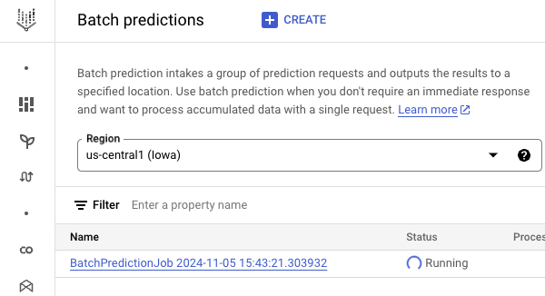
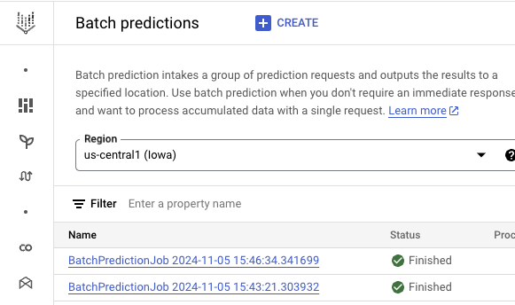

# Batch generation of content

Batch generation allows you to send multiple Generative AI requests in batches rather than in one by one and get responses
asynchronously either in a Cloud Storage bucket or a BigQuery table. This simplifies processing large datasets, 
saves time and money, as batch requests are discounted 50% from standard requests.

In this tutorial, you'll learn how to run batch generation jobs.

## Create Cloud Storage buckets

You can use either Cloud Storage or BigQuery to prepare and save batch job results. In this tutorial, we'll use 
Cloud Storage.

First, we need a bucket to save batch request input files: 

```shell
PROJECT_ID=your-project-id
INPUT_BUCKET_URI=gs://$PROJECT_ID-batch-processing-input
gsutil mb $INPUT_BUCKET_URI
```

We also need a bucket to save the batch request results:

```shell
PROJECT_ID=your-project-id
OUTPUT_BUCKET_URI=gs://$PROJECT_ID-batch-processing-output
gsutil mb $OUTPUT_BUCKET_URI
```

## Prepare batch generation input files

Next, you need to prepare batch prediction input files in `jsonl` files. 

For example, take a look at [batch_request_text_input.jsonl](./batch_request_text_input.jsonl) where you can use text
prompts to batch generation of content:

```json
{"request": {"contents": [{"parts": {"text": "Give me a recipe for banana bread."}, "role": "user"}]}}
{"request": {"contents": [{"parts": {"text": "Give me a recipe for chocolate cake."}, "role": "user"}]}}
{"request": {"contents": [{"parts": {"text": "Give me a recipe for carrot cake."}, "role": "user"}]}}
{"request": {"contents": [{"parts": {"text": "Give me a recipe for vanilla cake."}, "role": "user"}]}}
{"request": {"contents": [{"parts": {"text": "Give me a recipe for red velvet cake."}, "role": "user"}]}}
{"request": {"contents": [{"parts": {"text": "Give me a recipe for lemon cake."}, "role": "user"}]}}
{"request": {"contents": [{"parts": {"text": "Give me a recipe for coconut cake."}, "role": "user"}]}}
{"request": {"contents": [{"parts": {"text": "Give me a recipe for strawberry shortcake."}, "role": "user"}]}}
{"request": {"contents": [{"parts": {"text": "Give me a recipe for cheesecake."}, "role": "user"}]}}
{"request": {"contents": [{"parts": {"text": "Give me a recipe for pound cake."}, "role": "user"}]}}
```

You can also use multimodal prompts with text, images, and videos for batch generation of content as shown in 
[batch_request_multimodal_input.jsonl](./batch_request_multimodal_input.jsonl):

```json
{"request":{"contents": [{"role": "user", "parts": [{"text": "List objects in this image."}, {"file_data": {"file_uri": "gs://cloud-samples-data/generative-ai/image/office-desk.jpeg", "mime_type": "image/jpeg"}}]}]}}
{"request":{"contents": [{"role": "user", "parts": [{"text": "List objects in this image."}, {"file_data": {"file_uri": "gs://cloud-samples-data/generative-ai/image/gardening-tools.jpeg", "mime_type": "image/jpeg"}}]}]}}
{"request":{"contents": [{"role": "user", "parts": [{"text": "What is the relation between the following video and image samples?"}, {"fileData": {"fileUri": "gs://cloud-samples-data/generative-ai/video/animals.mp4", "mimeType": "video/mp4"}}, {"fileData": {"fileUri": "gs://cloud-samples-data/generative-ai/image/cricket.jpeg", "mimeType": "image/jpeg"}}]}]}}
```

Upload both files to the input bucket:

```shell
gsutil cp batch_request_text_input.jsonl $INPUT_BUCKET_URI
gsutil cp batch_request_multimodal_input.jsonl $INPUT_BUCKET_URI
```

## Run batch generation

To run batch generation jobs, you need to submit a `BatchPredictionJob` with input dataset and output location:

```python
vertexai.init(project=args.project_id, location="us-central1")

# Submit a batch prediction job with Gemini model
batch_prediction_job = BatchPredictionJob.submit(
    source_model="gemini-1.5-flash-002",
    input_dataset=args.input_dataset_uri,
    output_uri_prefix=args.output_bucket_uri,
)
```

Then, you need to wait until the batch generation is done:

```python
while not batch_prediction_job.has_ended:
    print(f"Job state: {batch_prediction_job.state.name}")
    time.sleep(10)
    batch_prediction_job.refresh()
```

Run batch generation for text inputs:

```shell
python main.py --project_id $PROJECT_ID \
  --input_dataset_uri $INPUT_BUCKET_URI/batch_request_text_input.jsonl \
  --output_bucket_uri $OUTPUT_BUCKET_URI
```

As it's running, you can also see its status on Cloud Console:



Run batch generation for multimodal inputs:

```shell
python main.py --project_id $PROJECT_ID \
  --input_dataset_uri $INPUT_BUCKET_URI/batch_request_multimodal_input.jsonl \
  --output_bucket_uri $OUTPUT_BUCKET_URI
```

In the end, you'll see both batch jobs are done:



You'll also see the results in the bucket and see them in these files:

* [batch_request_text_output.jsonl](./batch_request_text_output.jsonl)
* [batch_request_multimodal_output.jsonl](./batch_request_multimodal_output.jsonl)

Nice! 

## References

* [Batch text generation](https://cloud.google.com/vertex-ai/generative-ai/docs/multimodal/batch-prediction-gemini)
* [Intro to Batch Predictions with the Gemini API](https://github.com/GoogleCloudPlatform/generative-ai/blob/main/gemini/batch-prediction/intro_batch_prediction.ipynb)
* [gemini_batch_predict_gcs.py](https://github.com/GoogleCloudPlatform/python-docs-samples/blob/4fe5495e7bfc7d7bc3c3dd41411e84af833a282e/generative_ai/batch_predict/gemini_batch_predict_gcs.py)