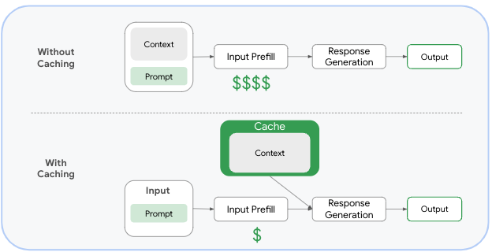

# Context caching

Context caching is useful in reducing costs when a substantial context is referenced repeatedly by shorter requests
such as:

* Chatbots with extensive system instructions
* Repetitive analysis of lengthy video files
* Recurring queries against large document sets
* Frequent code repository analysis or bug fixing



In this sample, you'll learn how to use context caching through the sample [main.py](./main.py).

## Without cached content

First, let's ask a question to LLM without context caching:

```python
model = GenerativeModel('gemini-1.5-flash-001')
prompt = "What are the papers about?"
response = model.generate_content(prompt)
```

Run it:

```shell
python main.py --project_id your-project-id generate_content
```

Not surprisingly, the LLM does not know what papers you're referring to:

```log
Prompt: What are the papers about?
Response: Please provide me with the papers you are referring to. I need the titles, authors, and any other relevant information about the papers for me to be able to tell you what they are about. 
```

## Create cached content

Let's create a cached content that can be used as context. The content has some system instructions and refers to a couple of PDFs:

```python
system_instruction = """
You are an expert researcher. You always stick to the facts in the sources provided, and never make up new facts.
Now look at these research papers, and answer the following questions.
"""

contents = [
    Part.from_uri(
        "gs://cloud-samples-data/generative-ai/pdf/2312.11805v3.pdf",
        mime_type="application/pdf",
    ),
    Part.from_uri(
        "gs://cloud-samples-data/generative-ai/pdf/2403.05530.pdf",
        mime_type="application/pdf",
    ),
]

cached_content = caching.CachedContent.create(
    model_name="gemini-1.5-pro-001",
    system_instruction=system_instruction,
    contents=contents,
    ttl=datetime.timedelta(minutes=60),
)
```

Run it:

```shell
python main.py --project_id your-project-id create_cached_content
```

You get back the information about the cached content:

```log
Cached content: <vertexai.caching._caching.CachedContent object at 0x12b652e50>: {
  "name": "projects/207195257545/locations/us-central1/cachedContents/3207266622129569792",
  "model": "projects/genai-atamel/locations/us-central1/publishers/google/models/gemini-1.5-pro-001",
  "createTime": "2024-06-28T09:59:37.340430Z",
  "updateTime": "2024-06-28T09:59:37.340430Z",
  "expireTime": "2024-06-28T10:59:37.329458Z"
}
```

## Generate with cached content

Now, let's try generating with the cache content we just created:

```python
cached_content = caching.CachedContent(cached_content_name=cache_id)
model = GenerativeModel.from_cached_content(cached_content=cached_content)
prompt = "What are the papers about?"
response = model.generate_content(prompt)
```

Run it:

```shell
python main.py --project_id your-project-id generate_content \
  --cache_id projects/207195257545/locations/us-central1/cachedContents/3207266622129569792
```

The model now knows what the papers are about from the cached content:

```log
Prompt: What are the papers about?
Response: The provided text describes the Gemini family of models, versions 1.0 and 1.5, focusing on 1.5 Pro. 

**Gemini 1.0** is a family of multimodal models trained on text, ...
```

The bigger the cached content and the more prompts use that content, you'll be
saving more money in the long run. The number of input tokens cached are billed
at a reduced rate when included in subsequent prompts.

## Delete cached content

You can either let the cache expire or delete it manually before the expiration:

```python
cached_content = caching.CachedContent(cached_content_name=cache_id)
cached_content.delete()
```

Run it:

```shell
python main.py --project_id your-project-id delete_cached_content \
  --cache_id projects/207195257545/locations/us-central1/cachedContents/3207266622129569792
```

The cache deleted:

```log
Cached content deleted: 3207266622129569792
```

## References

* [Context caching overview](https://cloud.google.com/vertex-ai/generative-ai/docs/context-cache/context-cache-overview)
* [Context caching Python samples](https://github.com/GoogleCloudPlatform/python-docs-samples/tree/main/generative_ai/context_caching)
* [Context caching notebook](https://colab.sandbox.google.com/drive/1VAXBWJMdd1QtQkNAPlEM4LYa7Bm8WYol)
