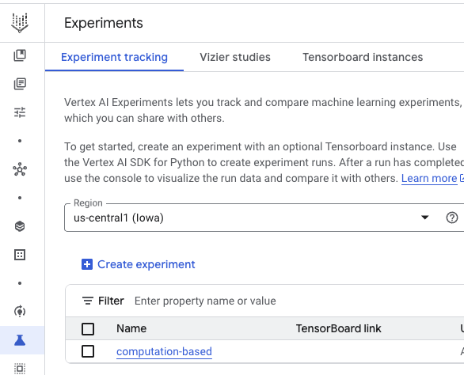
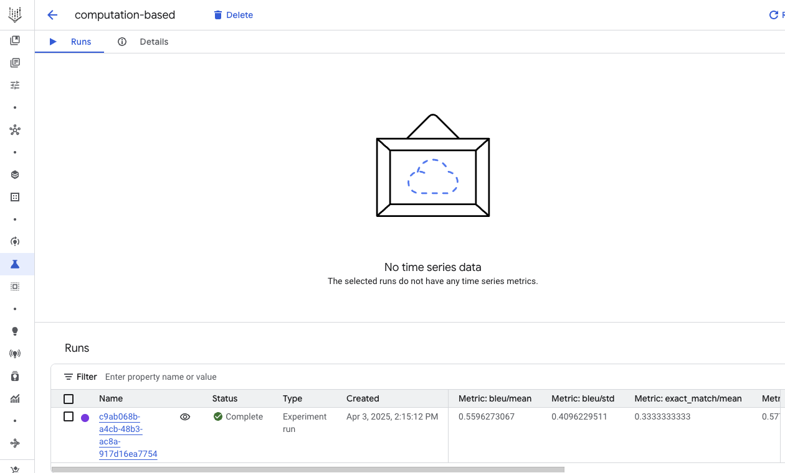

# Gen AI evaluation service - computation-based metrics

## Introduction 

These are the [computation-based](https://cloud.google.com/vertex-ai/generative-ai/docs/models/determine-eval#computation-based-metrics)
metrics supported by Gen AI evaluation service out of the box:
* Exact match 
* Bleu
* Rouge, Rouge-1, Rouge-2, Rouge-L, Rouge-LSum

> [!NOTE]
> There are also metrics related to tool use, which are technically computation-based metrics, but we'll cover them
> separately in [tool_use](../tool_use).

**Exact match** metric computes whether a generated text matches a reference text exactly.
0: No match, 1: Match

**Bleu** (BiLingual Evaluation Understudy) metric evaluates the similarity between generated text and reference text.
It measures precision (accuracy)
A float in the range of [0,1]
0: Poor similarity, 1: Perfect match to reference

**Rouge** (Recall-Oriented Understudy for Gisting Evaluation) metric evaluates text summaries.
It measures recall (completeness)
A float in the range of [0,1]
0: Poor similarity, 1: Strong similarity to reference.

Additionally, you can define your own custom metrics with [CustomMetric](https://github.com/googleapis/python-aiplatform/blob/main/vertexai/evaluation/metrics/_base.py#L75)
class.   

## Standard metrics

See [computation.py](./computation.py) on how you'd use these metrics in Gen AI evaluation service.

Run the evaluation:

```python
python computation.py
```

After a few seconds, you should see the results:
```console
==Summary metrics==
row_count: 3
exact_match/mean: 0.3333333333333333
exact_match/std: 0.5773502691896258
bleu/mean: 0.5596273066666667
bleu/std: 0.40962295108770713
rouge/mean: 0.8333333333333334
rouge/std: 0.16666665000000253
==Metrics table==
                  response                reference  exact_match/score  bleu/score  rouge/score
0      Hello, how are you?      Hello, how are you?                1.0    1.000000     1.000000
1                 I'm good                I am good                0.0    0.189959     0.666667
2  The cat lay on the mat.  The cat sat on the mat.                0.0    0.488923     0.833333
```

You can also see the results in the Experiments section of Vertex AI in Google Cloud console:





Note how inflexible exact match and bleu scores are. Even with the slightest difference, the scores go down. 
Rouge is slightly better but it also fails to properly capture the same semantic meanings. That's why we need model-based
metrics.

## Custom metrics

Instead of relying on standard metrics, you can define your own metrics with [CustomMetric](https://github.com/googleapis/python-aiplatform/blob/main/vertexai/evaluation/metrics/_base.py#L75)
class. 

See [computation_custom.py](computation_custom.py) for details.

Run the evaluation:

```python
python computation_custom.py
```
