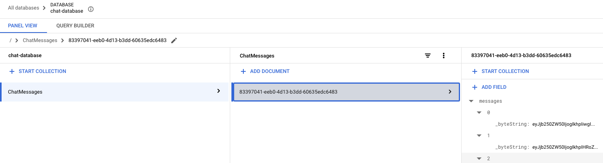

# LangChain - Chat with history saved to Firestore

## Introduction

In this sample, you'll see how to chat with Gemini on Vertex AI using LangChain and chat history saved to Firestore.

## Setup Firestore

Make sure you're logged in:

```shell
gcloud auth application-default login
```

Enable Firestore API:

```shell
gcloud services enable firestore.googleapis.com
```

Create a Firestore database:

```shell
gcloud firestore databases create --database chat-database --location=europe-west1
```

## Take a look at the app

You can take a look at the app in [main.py](main.py). 

## Run the app

Start a new chat session:

```sh
python main.py --project-id your-project-id
```

You can have a chat with Gemini now:

```sh
Created a new chat session id: 83397041-eeb0-4d13-b3dd-60635edc6483
User > Hello, my name is Mete
Assistant > Hello Mete! 👋 It's nice to meet you. 😊 What can I do for you today? 
```

Later, start the app with the id from the previous session:

```shell
python main.py --project_id genai-atamel --session_id 83397041-eeb0-4d13-b3dd-60635edc6483
```

You can see that the LLM remembers your name:

```shell
Using the provided chat session id: 83397041-eeb0-4d13-b3dd-60635edc6483
User > Do you remember my name?
Assistant > Yes, I do!  You said your name is Mete. 😊  
```

You can also see that the Firestore collection and documents have been populated with messages:



## References

* [Build LLM-powered applications using LangChain](https://cloud.google.com/firestore/docs/langchain)
* [Firestore Chat History + LangChain notebook](https://github.com/googleapis/langchain-google-firestore-python/blob/main/docs/chat_message_history.ipynb)~~
