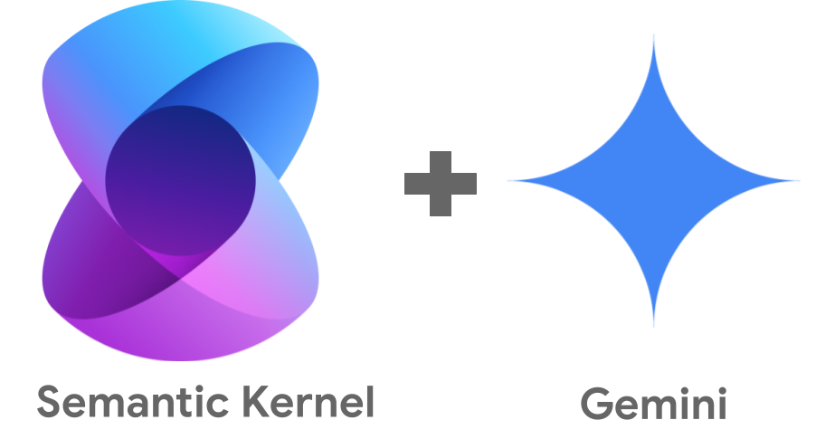

# Semantic Kernel - Chat with Gemini on Google AI



## Introduction

[Semantic Kernel](https://learn.microsoft.com/en-us/semantic-kernel/overview/)
open-source framework from Microsoft to build AI agents and integrate AI models
into your C#, Python, or Java applications.

In this sample, you'll see how to use Semantic Kernel with Gemini on Google AI
in a C# application.

## Get Gemini API key

For Gemini on Google AI, you need an API key. You can create an API key in [Google AI
Studio](https://aistudio.google.com/).

## Create a C# console application

Create a C# console application:

```sh
dotnet new console -o HelloWorldGeminiGoogleAi
```

## Install Semantic Kernel and Google connector

Add Semantic Kernel to your console app:

```sh
dotnet add package Microsoft.SemanticKernel
```

You also need the Google connector for Gemini model:

```sh
dotnet add package Microsoft.SemanticKernel.Connectors.Google --prerelease
```

## Build the app

We're now ready to build the app.

First, some imports, choosing the model we want to use and reading the API key from an env variable:

```csharp
using Microsoft.SemanticKernel;
using Microsoft.SemanticKernel.ChatCompletion;
using Microsoft.SemanticKernel.Connectors.Google;

public class Program
{
    const string ModelId = "gemini-1.5-flash";
    static readonly string ApiKey = Environment.GetEnvironmentVariable("GEMINI_API_KEY") ?? throw new ArgumentNullException("GEMINI_API_KEY environment variable is not set.");
```

Next, create a kernel with Google AI's Gemini chat completion. 

The Google chat completion connector is currently experimental. To use it, you
will need to add #pragma warning disable SKEXP0070:

```csharp
static async Task Main()
{
    // Create a kernel with Google AI's Gemini chat completion
#pragma warning disable SKEXP0070
    var builder = Kernel.CreateBuilder().AddGoogleAIGeminiChatCompletion(ModelId, ApiKey);
```

Build the kernel and initialize some settings for Gemini:

```csharp
// Build the kernel
Kernel kernel = builder.Build();
var chatCompletionService = kernel.GetRequiredService<IChatCompletionService>();

// Settings
GeminiPromptExecutionSettings settings = new()
{
    Temperature = 0.8,
    MaxTokens = 8192
};
```

Create a chat history and use it a loop for a conversation:

```csharp
// Create a history store the conversation
var history = new ChatHistory();

// Initiate a back-and-forth chat
string? userInput;
while (true)
{
    // Collect user input
    Console.Write("User > ");
    userInput = Console.ReadLine();
    if (userInput == null)
    {
        break;
    }

    // Add user input
    history.AddUserMessage(userInput);

    // Get the response from the AI
    var result = await chatCompletionService.GetChatMessageContentAsync(
        history,
        executionSettings: settings,
        kernel: kernel);

    // Print the results
    Console.WriteLine("Assistant > " + result);

    // Add the message from the agent to the chat history
    history.AddMessage(result.Role, result.Content ?? string.Empty);
}
```

You can see the full [Program.cs](./Program.cs).

## Run the app

To run the app, first you need to set your API key:

```sh
export GEMINI_API_KEY=your-api-key
```

Run the app:

```sh
dotnet run
```

You can have a chat with Gemini now:

```sh
User > Hello
Assistant > Hello! How can I help you today? 

User > How are you?
Assistant > I'm doing well, thank you for asking! As a large language model, I don't have feelings like humans do,
but I'm here and ready to help you with any questions or tasks you might have. What about you? How are you doing today?
```

## References

* [A comparative overview of LangChain, Semantic Kernel, AutoGen and more](https://medium.com/data-science-at-microsoft/harnessing-the-power-of-large-language-models-a-comparative-overview-of-langchain-semantic-c21f5c19f93e). 
* [Getting started with Semantic Kernel](https://learn.microsoft.com/en-us/semantic-kernel/get-started/quick-start-guide?). 
* [Chat completion tutorial - C# and Google Gemini](https://learn.microsoft.com/en-us/semantic-kernel/concepts/ai-services/chat-completion/?tabs=csharp-Google)
