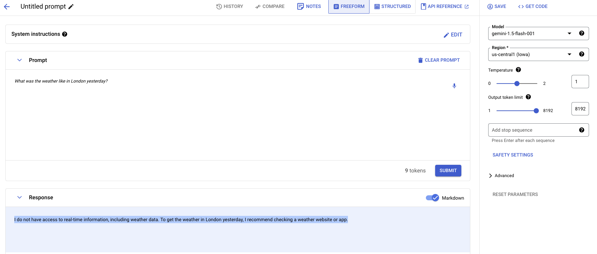
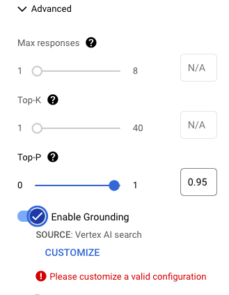

# Grounding with public data with Google Search

In this sample, you'll learn how to ground LLM with Vertex AI’s Google Search.
More specifically, you'll:

1. Ask the LLM questions that require recent data. For example, "How's the
   weather in London today?" and see that it cannot answer questions that
   require recent data.
1. Ground the LLM with Vertex AI's Google Search.
1. Ask the LLM the same questions again and see that you get answers back.

## Without grounding

First, let's ask a question to the LLM about the weather without any
grounding. You can do this in [Vertex AI section of Google Cloud
Console](https://console.cloud.google.com/vertex-ai/generative/language/create/text)
against any model.

Prompt:
> What was the weather like in London yesterday?

Response:
> I do not have access to real-time information, including weather data. To get
> the weather in London yesterday, I recommend checking a weather website or
> app.



As you can see, the model cannot answer questions about the weather yesterday,
as it's not trained on that data.

There's also a [main.py](main.py) sample that you can run **without** grounding:

```sh
python main.py --project_id your-project-id
```

You get a similar response:

```sh
Prompt: What was the weather like in London yesterday?
Response text: I do not have access to real-time information, including weather data. To get the weather information for London yesterday, I recommend checking a reliable weather website or app.
```

## Setup grounding with Google Search

Let's setup grounding with Google Search now.

Go back to [Vertex AI section of Google Cloud
Console](https://console.cloud.google.com/vertex-ai/generative/language/create/text)
and in the `Advanced` section, select `Enable grounding`:



Customize grounding and point to Google Search:


## With grounding

Finally, we're ready to ask questions about the weather **with** grounding enabled.

Prompt:
> What was the weather like in London yesterday?

Response:
> Yesterday, June 17th, 2024, London had a high temperature of 73 degrees Fahrenheit and a low of 52 degrees Fahrenheit.

Also run [main.py](main.py) Python sample **with** grounding:

```sh
python main.py --project_id your-project-id --google_search_grounding
```

You get a similar response:

```sh
Prompt: What was the weather like in London yesterday?
Response text: Yesterday in London, the temperature ranged from a low of 52°F to a high of 70°F. The weather was mostly sunny with some passing clouds.
```

Yay, it works!

## References

* [Grounding overview documentation](https://cloud.google.com/vertex-ai/generative-ai/docs/grounding/overview)
* [Grounding decision flowchart](https://cloud.google.com/docs/ai-ml/generative-ai#grounding)
* [Getting Started with Grounding with Gemini in Vertex AI notebook](https://github.com/GoogleCloudPlatform/generative-ai/blob/main/gemini/grounding/intro-grounding-gemini.ipynb)
* [Grounding for Gemini with Vertex AI Search and DIY RAG talk](https://youtu.be/v4s5eU2tfd4)