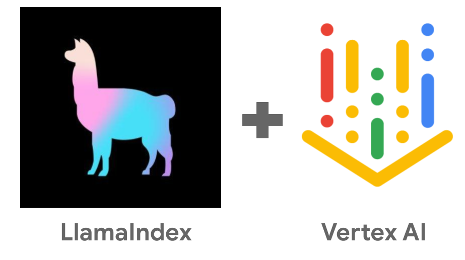

# LlamaIndex on Vertex AI with RAG API



## Introduction

[LlamaIndex](https://www.llamaindex.ai/) is a popular data framework for developing context-augmented LLM apps.
[RAG API](https://cloud.google.com/vertex-ai/generative-ai/docs/model-reference/rag-api) is a new LlamaIndex powered API
that provides everything you need for retrieval augmented generation (RAG): indexing, embedding, retrieval, and generation. 

There are a few reasons why you might consider LlamaIndex with RAG API:

1. Easy to set up and use.
1. Connects to a range of data sources: local files, Google Cloud Storage, Google Drive.
1. Supports a number of different file types: Google docs, drawings, slides, HTML, JSON, markdown, PPTX, DOCX, PDF, and text files.
1. Supports a number of customizations: `chunk_size` and `chunk_overlap` for ingestion, `similarity_top_k` and
   `vector_distance_threshold` for retrieval.  

## Cymbal Starlight 2024
Imagine you own the 2024 model of a fictitious vehicle called Cymbal Starlight. It has a user’s manual in PDF format 
([cymbal-starlight-2024.pdf](cymbal-starlight-2024.pdf)) and you want to ask LLM questions about this vehicle from the manual. 

LLMs are not trained with this user manual and they won’t be able to answer any questions about the vehicle but we’ll 
see how to use the RAG API to augment our LLM.

There's a [main.py](./main.py) sample to show how to use the RAG API.

## Without RAG

First, let's ask a question to the LLM about the vehicle without any RAG:

```python
model = GenerativeModel(model_name="gemini-1.5-flash-001")
response = model.generate_content(
  "What is the cargo capacity of Cymbal Starlight?",
  generation_config=GenerationConfig(temperature=0.0)
)
```

Run it:

```sh
 python main.py --project your-project-id generate_text \
  --prompt "What is the cargo capacity of Cymbal Starlight?" 
```

You get a response like this:

```sh
Prompt: What is the cargo capacity of Cymbal Starlight?
Response text: I do not have access to real-time information, including specific details 
about ships like the "Cymbal Starlight." 
```

Not surprisingly, the LLM does not know about the vehicle.

## Create a RAG corpus

Before you can ingest a PDF, you need to create a RAG corpus, an index to import or upload documents:

```python
corpus = rag.create_corpus(display_name=corpus_display_name)
```

Run it:

```sh
python main.py --project_id your-project-id create_corpus --display_name cymbal-starlight-corpus

Corpus created: projects/207195257545/locations/us-central1/ragCorpora/8935141660703064064
```

## Upload a file

Next, you need to either a file to the corpus directly or host it on Google 
Cloud Storage or Google Drive and point to it. 

In this case, let's upload the fictitious [cymbal-starlight-2024.pdf](cymbal-starlight-2024.pdf) user manual file.

```python
rag_file = rag.upload_file(
   corpus_name=corpus_name,
   path=path,
   display_name=display_name,
   description=description,
)
```

Run it:

```sh
python main.py --project_id your-project-id upload_file \
  --corpus_name projects/207195257545/locations/us-central1/ragCorpora/8935141660703064064 \ 
  --path cymbal-starlight-2024.pdf --display_name cymbal-starlight-2024.pdf
  
File upload to corpus: projects/207195257545/locations/us-central1/ragCorpora/8935141660703064064
-name: projects/207195257545/locations/us-central1/ragCorpora/8935141660703064064/ragFiles/8935141660703064064
 display_name: cymbal-starlight-2024.pdf
```

## Direct retrieve

At this point, you can do a direct retrieve from the corpus with top k relevant docs/chunks:

```python
response = rag.retrieval_query(
  rag_resources=[
      rag.RagResource(
          rag_corpus=corpus_name
          # Supply IDs from `rag.list_files()`.
          # rag_file_ids=["rag-file-1", "rag-file-2", ...],
      )
  ],
  text="What is the cargo capacity of Cymbal Starlight?",
  similarity_top_k=10,  # Optional
  vector_distance_threshold=0.5,  # Optional
)
```

Run it:

```sh
python main.py --project_id your-project-id direct_retrieve \
  --corpus_name projects/207195257545/locations/us-central1/ragCorpora/8935141660703064064 \ 
  --text "What is the cargo capacity of Cymbal Starlight?"
```

And you should get back a list of chunks:

```log
Text: What is the cargo capacity of Cymbal Starlight?
Response: contexts {
  contexts {
    source_uri: "cymbal-starlight-2024.pdf"
    text: "This light may illuminate for a variety of reasons, ..."
    distance: 0.37499325722150889
  },
 contexts {
 ...
}
```

## With grounding

Finally, we're ready to ground the LLM with the RAG corpus and ask questions about the vehicle.

```python
model = GenerativeModel(model_name="gemini-1.5-flash-001")

tools = [Tool.from_retrieval(
   retrieval=rag.Retrieval(
       source=rag.VertexRagStore(
           rag_resources=[
               rag.RagResource(
                   rag_corpus=corpus_name,  # Currently only 1 corpus is allowed.
                   # Supply IDs from `rag.list_files()`.
                   # rag_file_ids=["rag-file-1", "rag-file-2", ...],
               )
           ],
           similarity_top_k=3,  # Optional
           vector_distance_threshold=0.5,  # Optional
       ),
   )
)]

response = model.generate_content(
  "What is the cargo capacity of Cymbal Starlight?",
  tools=tools,
  generation_config=GenerationConfig(
      temperature=0.0,
  ),
)
```

Run it:

```sh
python main.py --project genai-atamel generate_text \
  --corpus_name projects/207195257545/locations/us-central1/ragCorpora/8935141660703064064 \
  --prompt "What is the cargo capacity of Cymbal Starlight?" 
```

You get a response like this:

```sh
Corpus name: projects/207195257545/locations/us-central1/ragCorpora/8935141660703064064
Prompt: What is the cargo capacity of Cymbal Starlight?
Response text: The Cymbal Starlight has a cargo capacity of 13.5 cubic feet. The cargo area is located in the trunk of the vehicle. 
```

Let's ask another question:

```sh
python main.py --project genai-atamel generate_text \
  --corpus_name projects/207195257545/locations/us-central1/ragCorpora/8935141660703064064 \
  --prompt "What's the emergency roadside assistance phone number?"
```

Response:

```sh
Corpus name: projects/207195257545/locations/us-central1/ragCorpora/8935141660703064064
Prompt: What's the emergency roadside assistance phone number?
Response text: The emergency roadside assistance phone number is 1-800-555-1212. 
```

Yay, it works!

## References

* [LlamaIndex on Vertex AI for RAG overview docs](https://cloud.google.com/vertex-ai/generative-ai/docs/llamaindex-on-vertexai)
* [LlamaIndex on Vertex AI for RAG API](https://cloud.google.com/vertex-ai/generative-ai/docs/model-reference/rag-api)
* [rag.py sample](https://github.com/GoogleCloudPlatform/python-docs-samples/blob/2cc418ecbd065603585a18935201067182ea3417/generative_ai/rag.py)
* [Grounding decision flowchart](https://cloud.google.com/docs/ai-ml/generative-ai#grounding)
* [Grounding for Gemini with Vertex AI Search and DIY RAG talk](https://youtu.be/v4s5eU2tfd4)
