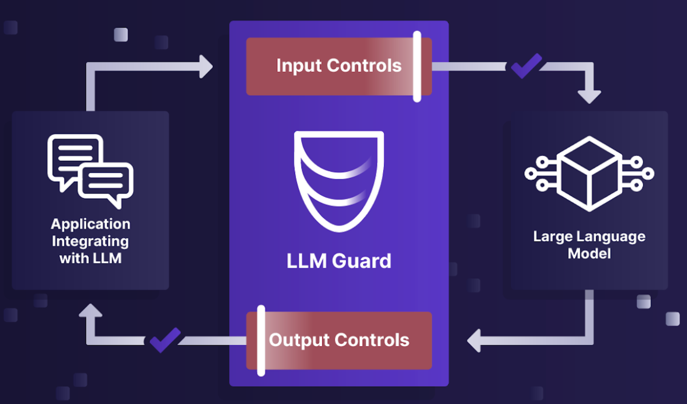

# LLM Guard and Vertex AI

[LLM Guard](https://llm-guard.com/) is a security toolkit for LLMs. 



It has input and output scanners offering sanitization, harmful language detection, data leakage prevention, guard 
against prompt injections and more to make LLMs interactions safe and secure.

In this tutorial, you'll learn how to use LLM Guard with Vertex AI.

## Input scanners

Input scanners allow you to scan and sanitize user prompts. 

For example, you can detect code in user prompts:

```python
def ban_code_input():
    prompt = "System.out.println('Hello World')"
    scanner = input_scanners.BanCode()
    prompt, is_valid, risk_score = scanner.scan(prompt)
    print_results(is_valid, prompt, risk_score)
```

```shell
python main.py ban_code_input

Detected code in the text      score=1.0 text=System.out.println('Hello World') threshold=0.97
Input/output: System.out.println('Hello World')
Valid? False
Risk score: 1.0
```

Or you can ban certain topics in user prompts:

```python
def ban_topics_input():
    prompt = "Keir Starmer is the prime minister of the UK"
    scanner = input_scanners.BanTopics(topics=["politics"], threshold=0.5)
    prompt, is_valid, risk_score = scanner.scan(prompt)
    print_results(is_valid, prompt, risk_score)
```

```shell
python main.py ban_topics_input

Topics detected for the prompt scores={'politics': 0.9804285764694214}
Input/output: Keir Starmer is the prime minister of the UK
Valid? False
Risk score: 1.0
```

You can see more examples in [main.py](./main.py).

## Output scanners

Output scanners allow you to scan and sanitize model outputs. 

For example, you can detect gibberish in model outputs as follows:

```python
def gibberish_output():
    from llm_guard.input_scanners.gibberish import MatchType

    model_output = "abcasd asdkhasd asdasd"
    scanner = output_scanners.Gibberish(match_type=MatchType.FULL)
    model_output, is_valid, risk_score = scanner.scan("", model_output)
    print_results(is_valid, model_output, risk_score)
```

```shell
python main.py gibberish_output

Detected gibberish text        score=1.0 threshold=0.7
Input/output: abcasd asdkhasd asdasd
Valid? False
Risk score: 1.0
```

Or detect if the output is in a certain language:

```python
def language_output():
    from llm_guard.input_scanners.gibberish import MatchType

    model_output = "This is some text in English"
    scanner = output_scanners.Language(valid_languages=["fr"], match_type=MatchType.FULL)
    model_output, is_valid, risk_score = scanner.scan("", model_output)
    print_results(is_valid, model_output, risk_score)
```

```shell
python main.py language_output

Languages are found with high confidence languages=['en']
Input/output: This is some text in English
Valid? False
Risk score: 1.0
```

You can see more examples in [main.py](./main.py).

## Anonymize/Deanonymize scanner with Vertex AI

Let's take another example. Sometimes, it's a good idea to anonymize personal data before sending to the LLM. 

Take this prompt with a number of personal data:

```python
prompt = ("Make an SQL insert statement to add a new user to our database. Name is John Doe. Email is "
          "test@test.com but also possible to contact him with hello@test.com email. Phone number is 555-123-4567 "
          "and the IP address is 192.168.1.100. And credit card number is 4567-8901-2345-6789. " +
          "He works in Test LLC. " +
          "Only return the SQL statement and nothing else")
```

You can anonymize it like this:

```python
vault = Vault()
input_scanners = [Anonymize(vault)]
sanitized_prompt, results_valid, results_score = scan_prompt(input_scanners, prompt)
```

You get back this sanitized prompt:

```shell
Sanitized prompt: Make an SQL insert statement to add a new user to our database. Name is [REDACTED_PERSON_1] Doe. 
Email is [REDACTED_EMAIL_ADDRESS_1] but also possible to contact him with [REDACTED_EMAIL_ADDRESS_2] email. 
Phone number is [REDACTED_PHONE_NUMBER_1] and the IP address is [REDACTED_IP_ADDRESS_1]. 
And credit card number is [REDACTED_CREDIT_CARD_RE_1]. He works in Test LLC. Only return the SQL statement and nothing else
```

Then, you pass this back to Vertex AI:

```python
model = GenerativeModel('gemini-1.5-flash-001')
response = model.generate_content(sanitized_prompt)
```

And the response you get back is as follows:

```shell
Response text: ```sql
INSERT INTO users (name, email, alternative_email, phone, ip_address, credit_card, company) VALUES ('[REDACTED_PERSON_1] Doe', 
'[REDACTED_EMAIL_ADDRESS_1]', '[REDACTED_EMAIL_ADDRESS_2]', '[REDACTED_PHONE_NUMBER_1]', '[REDACTED_IP_ADDRESS_1]', 
'[REDACTED_CREDIT_CARD_RE_1]', 'Test LLC');
```

You then feed this back to the deanonymizer:

```python
output_scanners = [Deanonymize(vault)]
sanitized_response_text, results_valid, results_score = scan_output(
    output_scanners, sanitized_prompt, response.text
)
```

And you get back the deanonymized output:

```shell
Sanitized output: ```sql
INSERT INTO users (name, email, alternative_email, phone, ip_address, credit_card, company) 
VALUES ('John Doe', 'test@test.com', 'hello@test.com', '555-123-4567', '192.168.1.100', '4567-8901-2345-6789', 'Test LLC');
```

You can see the full example in [anonymize_vertexai.py](./anonymize_vertexai.py)

## Multiple scanners with Vertex AI

You can also chain multiple input and output scanners as follows:

```python
input_scanners = [Anonymize(vault), Toxicity(), TokenLimit(), PromptInjection()]
output_scanners = [Deanonymize(vault), NoRefusal(), Relevance(), Sensitive()]
```

You can see the full example in [multiple_vertexai.py](./multiple_vertexai.py).

## References

* [Input scanners](https://llm-guard.com/input_scanners/anonymize/)
* [Output scanners](https://llm-guard.com/output_scanners/ban_competitors/)