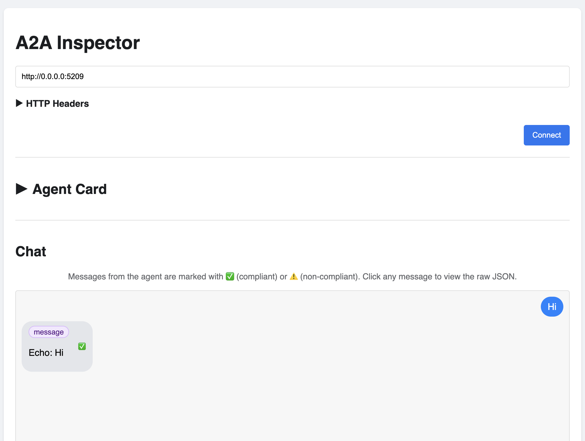

# Echo Agent - Python

A barebones agent that demonstrates the core concepts of A2A protocol. This agent receives messages and respond by
echoing them back, providing a clear example of how A2A communication flows.

Here are the relevant files:

* [`agent.py`](./agent.py): An agent that simply echoes back the received message.
* [`agent_executor.py`](./agent_executor.py): A wrapper around the EchoAgent to implement execute and cancel methods in
order to participate in A2A framework.
* [`__main__.py`](./__main__.py): The entry point of the A2A server which defines the agent card and request handler and runs the server.
* [`a2a_client.py`](./a2a_client.py): A2A client to test the A2A server.

## Start the agent with the A2A server

Create and activate a virtual environment:

```shell
python -m venv .venv
source .venv/bin/activate
```

Install dependencies:

```shell
pip install -r requirements.txt
```

Start the A2A server with the agent:

```shell
python __main__.py

INFO:     Started server process [61536]
INFO:     Waiting for application startup.
INFO:     Application startup complete.
INFO:     Uvicorn running on http://0.0.0.0:5209 (Press CTRL+C to quit)
```

## Test the A2A server with A2AClient

In a separate terminal, test the agent:

```shell
python a2a_client.py

INFO:httpx:HTTP Request: POST http://localhost:5209/agent "HTTP/1.1 200 OK"
{'id': '2a369695-7b4a-49bf-8cdb-5f4e1622da73', 'jsonrpc': '2.0', 'result': {'kind': 'message', 'messageId': 'a0654c73-60f8-43aa-ab21-68ee427d47df', 'parts': [{'kind': 'text', 'text': 'Echo: "Hello from the A2A client!"'}], 'role': 'agent'}}
```

## Test the A2A server with A2A Inspector

[A2A Inspector](https://github.com/a2aproject/a2a-inspector) is a web-based tool designed to help developers inspect,
debug, and validate servers that implement the A2A protocol.

Follow [Setup and Running the Application](https://github.com/a2aproject/a2a-inspector?tab=readme-ov-file#setup-and-running-the-application) to install the A2A Inspector.

Inside `a2a-inspector` folder, start the A2A Inspector:

```shell
/run.sh

Starting A2A Inspector...
Starting frontend build (watch mode)...
...
[BACKEND] INFO:     Uvicorn running on http://127.0.0.1:5001 (Press CTRL+C to quit)
```

Open `http://127.0.0.1:5001` in the browser, enter `http://0.0.0.0:5209` for the agent. Now, you can connect to the
agent, download agent card, and chat with the agent over A2A:



## References

* [Python Quickstart Tutorial: Building an A2A Agent](https://a2a-protocol.org/latest/tutorials/python/1-introduction/)
* [A2A Python SDK](https://github.com/a2aproject/a2a-python)
* [A2A Inspector](https://github.com/a2aproject/a2a-inspector)
