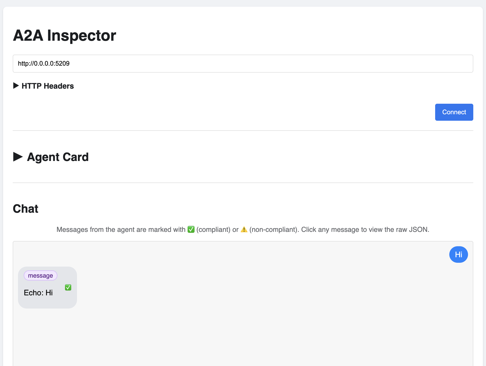

# Echo Agent - CSharp

A barebones agent that demonstrates the core concepts of A2A protocol. This agent receives messages and respond by
echoing them back, providing a clear example of how A2A communication flows.

Here are the relevant projects:

* [A2AAgent](./A2AAgent/) is the agent with the A2A server.
* [A2AClient](./A2AClient/) is the A2AClient to connect and test the A2A server.

## Start the agent with the A2A server

Start the agent:

```shell
cd A2AAgent
dotnet run

info: Microsoft.Hosting.Lifetime[14]
      Now listening on: http://localhost:5209
info: Microsoft.Hosting.Lifetime[0]
      Application started. Press Ctrl+C to shut down.
info: Microsoft.Hosting.Lifetime[0]
      Hosting environment: Development
info: Microsoft.Hosting.Lifetime[0]
      Content root path: /Users/atamel/dev/github/meteatamel/genai-beyond-basics/samples/protocols/a2a/echo/csharp/A2AAgent
```

## Test the A2A server with A2AClient

In a separate terminal, test the agent:

```shell
cd A2AClient/

Connected to agent: Echo Agent
Description: An agent that will echo every message it receives.
Streaming support: True

=== Non-Streaming Communication ===
Received response: Echo: Hello from the A2A client!

=== Streaming Communication ===
Received streaming chunk: Echo: Hello from the A2A client!
```

## Test the A2A server with A2A Inspector

[A2A Inspector](https://github.com/a2aproject/a2a-inspector) is a web-based tool designed to help developers inspect,
debug, and validate servers that implement the A2A protocol.

Follow [Setup and Running the Application](https://github.com/a2aproject/a2a-inspector?tab=readme-ov-file#setup-and-running-the-application) to install the A2A Inspector.

Inside `a2a-inspector` folder, start the A2A Inspector:

```shell
/run.sh

Starting A2A Inspector...
Starting frontend build (watch mode)...
...
[BACKEND] INFO:     Uvicorn running on http://127.0.0.1:5001 (Press CTRL+C to quit)
```

Open `http://127.0.0.1:5001` in the browser, enter `http://0.0.0.0:5209/.well-known/agent.json` for the agent.

> [!NOTE]
> Normally, you'd need to only enter `http://0.0.0.0:5209` and A2A Inspector would fetch the card from
> `http://0.0.0.0:5209/.well-known/agent-card.json` but C# A2A library still uses the legacy agent card url
> `http://0.0.0.0:5209/.well-known/agent.json`.

Now, you can connect to the agent, download agent card, and chat with the agent over A2A:



## References

* [Blog: Building AI Agents with the A2A .NET SDK](https://devblogs.microsoft.com/foundry/building-ai-agents-a2a-dotnet-sdk/)
* [A2A .NET SDK](https://github.com/a2aproject/a2a-dotnet)
* [A2A Inspector](https://github.com/a2aproject/a2a-inspector)