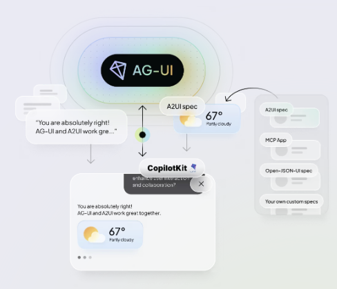

# Agent to UI Protocol (A2UI)

## Overview

[A2UI](https://a2ui.org/) is a declarative UI protocol, from Google, that enables AI agents to generate rich,
interactive user interfaces across web, mobile, desktop. 

## A2UI vs. AG-UI

Despite similar names, AG-UI and A2UI serve very different and complementary roles in the agentic application stack:

* **AG-UI** connects your user-facing application to any agentic backend.
* **A2UI** is a declarative generative UI spec, originated by Google, which agents can use to return UI widgets as part
  of their responses.

See [AG-UI and Generative UI Specs](https://docs.ag-ui.com/concepts/generative-ui-specs) and [AG-UI and
A2UI](https://www.copilotkit.ai/ag-ui-and-a2ui) for more details.

## Steps

Follow these steps to learn more:

* [A2UI with Agent Development Kit (ADK)](./adk/)
* TODO: [A2UI with CopilotKit and Agent Development Kit (ADK)](./copilotkit)

## References

* [Docs: A2UI protocol](https://a2ui.org/)
* [GitHub: A2UI](https://github.com/google/A2UI) & [A2UI protocol spec](https://github.com/google/A2UI/tree/main/specification)
* [Blog: Introducing A2UI: An open project for agent-driven interfaces](https://developers.googleblog.com/introducing-a2ui-an-open-project-for-agent-driven-interfaces/)
* [AG-UI and A2UI](https://www.copilotkit.ai/ag-ui-and-a2ui)
* [AG-UI and Generative UI Specs](https://docs.ag-ui.com/concepts/generative-ui-specs)
* [Agent UI Ecosystem](https://a2ui.org/introduction/agent-ui-ecosystem/)
---
* [CopilotKit Generative UI](https://www.copilotkit.ai/generative-ui)
* [CopilotKit + A2UI](https://docs.copilotkit.ai/a2a/generative-ui/declarative-a2ui)
* [CopilotKit A2UI Composer](https://a2ui-composer.ag-ui.com/)
* [GitHub: CopilotKit <> A2A + A2UI Starter](https://github.com/CopilotKit/with-a2a-a2ui)
---
* [YouTube: A2UI: The Protocol That Makes AI Design Functional UIs](https://youtu.be/PS8mZFhodfE)
* [YouTube: AI Agents Can Now Build Their Own UI in Real Time](https://youtu.be/MD8VQzvMVek)
---
