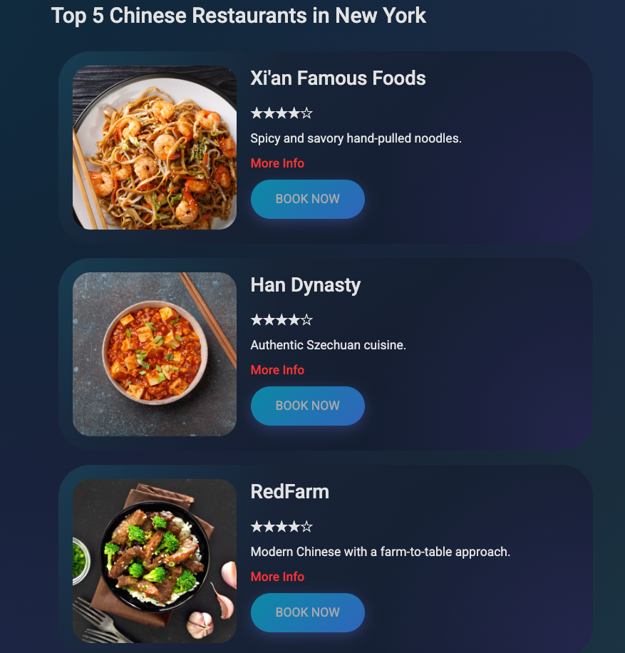
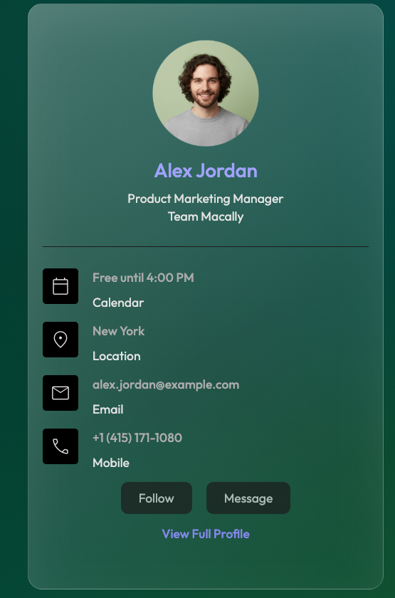
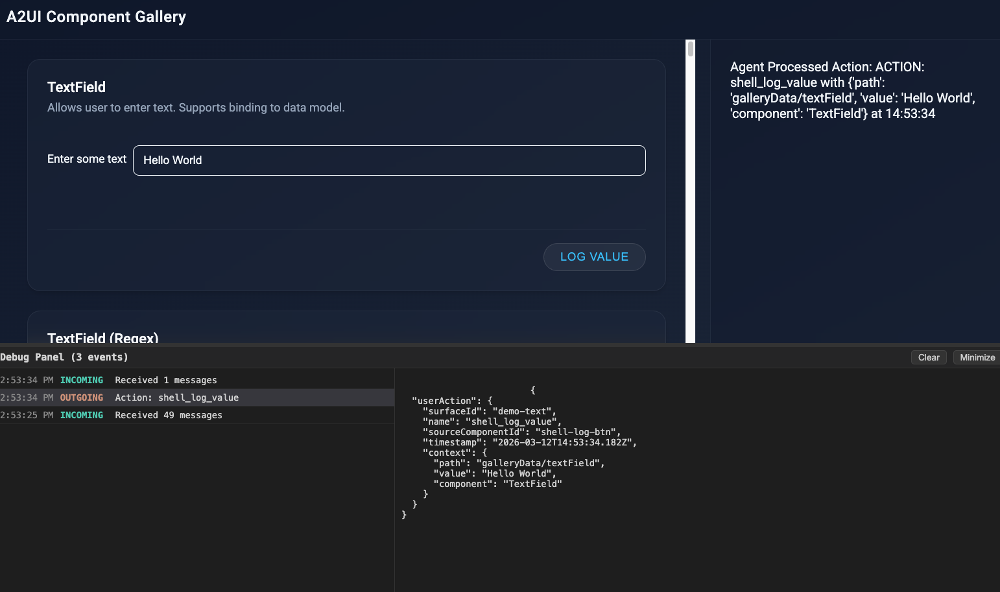

# A2UI with Agent Development Kit (ADK)

Let's look at some samples on how you can generate UI with A2UI and ADK agents. 

## Before you start

Clone the repository:

```sh
git clone https://github.com/google/a2ui.git
cd a2ui
```

Set your Gemini API key:

```sh
export GEMINI_API_KEY="your_gemini_api_key_here"
```

Samples have server (agent) and client (renderer) parts that both need to be started. You can find different ADK agent
samples in [adk](https://github.com/google/A2UI/tree/main/samples/agent/adk) and client renderers in
[client](https://github.com/google/A2UI/tree/main/samples/client) folders in the A2UI repo.

## Restaurant Finder app

To run the restaurant finder app, start both the agent and the client servers.

Inside the [`samples/client/lit`](https://github.com/google/A2UI/tree/main/samples/client/lit) folder:

```sh
npm run demo:restaurant
```

This starts both the agent and the client servers. Navigate to `http://localhost:5173/?app=restaurant` and start 
prompting your AI agent. For example `Top 5 Chinese restaurants in New York`:

You should see the UI generated by the agent and rendered on the client side:



If you look into the logs, you should also see the A2UI JSON response:

```json
[REST] LiteLLM completion() model= gemini-2.5-flash; provider = gemini
[REST] INFO:agent:Event from runner: model_version='gemini-2.5-flash' content=Content(
[REST]   parts=[
[REST]     Part(
[REST]       text="""<a2ui-json>
[REST] [
[REST]   {
[REST]     "beginRendering": {
[REST]       "surfaceId": "default",
[REST]       "root": "root-column",
[REST]       "styles": {
[REST]         "primaryColor": "#FF0000",
[REST]         "font": "Roboto"
[REST]       }
[REST]     }
[REST]   },
[REST]   {
[REST]     "surfaceUpdate": {
[REST]       "surfaceId": "default",
[REST]       "components": [
[REST]         {
[REST]           "id": "root-column",
[REST]           "component": {
[REST]             "Column": {
[REST]               "children": {
[REST]                 "explicitList": [
[REST]                   "title-heading",
[REST]                   "item-list"
[REST]                 ]
[REST]               }
[REST]             }
[REST]           }
[REST]         },
...
```

Let's take a look at what's happening under the hood. 

On the agent side, you can take a look at the agent code in [`samples/agent/adk/restaurant_finder`](https://github.com/google/A2UI/tree/main/samples/agent/adk/restaurant_finder). Specifically, [`prompt_builder.py`](https://github.com/google/A2UI/blob/main/samples/agent/adk/restaurant_finder/prompt_builder.py) shows how to build the prompt for the agent to generate A2UI responses.

On the client side, you can take a look at the Lit implementation of A2UI in [`renderers/lit`](https://github.com/google/A2UI/tree/main/renderers/lit). 

## Contact manager app

You can also try the contact manager app:

```sh
npm run demo:contact
```

You should see the UI generated and rendered:



## A2UI Component Gallery Agent

This is a "kitchen sink" example, rendering every available component in the A2UI standard catalog to showcase their
visual appearance and interactive behavior.

In the [samples/agent/adk/componenet_gallery](https://github.com/google/A2UI/tree/main/samples/agent/adk/component_gallery)
directory, start the ADK agent:

```sh
uv run .
```

In the [samples/client/lit_component_gallery](https://github.com/google/A2UI/tree/main/samples/client/lit/component_gallery)
directory, install dependencies

```sh
npm install
```

Start the dev server:

```sh
npm run dev
```

Navigate to `http://localhost:5173`. You should see the component gallery:



## References

* [GitHub: A2UI samples](https://github.com/google/A2UI/tree/main/samples)