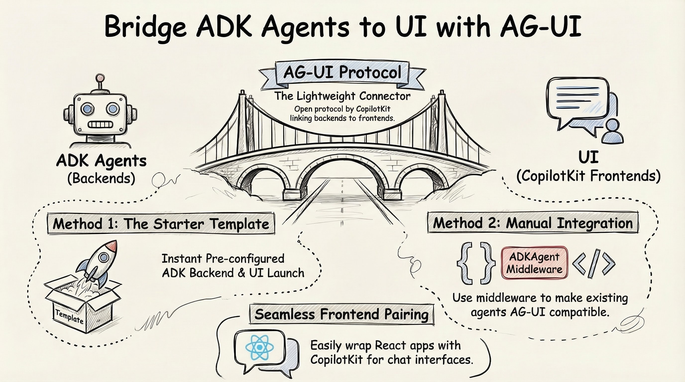

# Agent-User Interaction Protocol (AG-UI)

## Overview

[AG-UI](https://github.com/ag-ui-protocol/ag-ui) is an open, lightweight, event-based protocol, created by the
[CopilotKit](https://www.copilotkit.ai/), that standardizes how agent backends connect to agent frontends. It enables seamless integration between AI agents and user interfaces.

**Clients**: [CopilotKit](https://github.com/CopilotKit/CopilotKit) is the reference client implementation of AG-UI but there are others [clients](https://docs.ag-ui.com/introduction#clients).

**Agent Frameworks**: Most major agent frameworks such as LangGraph, CrewAI, Google ADK and [more](https://docs.ag-ui.com/introduction#agent-framework-1st-party) are supported.

The main benefits of AG-UI protocol is:

* **Event-Driven Communication**: Agents emit any of the 16 standardized event types during execution, creating a stream of updates that clients can process.
* **Bidirectional Interaction**: Agents accept input from users, enabling collaborative workflows where humans and AI work together seamlessly.
* **Transport Agnostic**: AG-UI doesn’t mandate how events are delivered, supporting various transport mechanisms including Server-Sent Events (SSE), webhooks, WebSockets, and more. 

You can read more details on AG-UI protocol in [Core architecture](https://docs.ag-ui.com/concepts/architecture) and
[Events](https://docs.ag-ui.com/concepts/events) docs.

## AG-UI vs. MCP, A2A

AG-UI is complementary to MCP and A2A:

* **MCP** gives agents tools.
* **A2A** allows agents to communicate with other agents.
* **AG-UI** brings agents into user-facing applications.

See [MCP, A2A, and AG-UI](https://docs.ag-ui.com/agentic-protocols) for more details.

## AG-UI vs. A2UI

Despite similar names, AG-UI and A2UI serve very different and complementary roles in the agentic application stack:

* **AG-UI** connects your user-facing application to any agentic backend.
* **A2UI** is a declarative generative UI spec, originated by Google, which agents can use to return UI widgets as part
  of their responses.

 AG-UI is not a generative UI specification — it’s a user interaction protocol that provides the bi-directional runtime
 connection between the agent and the application. See [AG-UI and Generative UI
 Specs](https://docs.ag-ui.com/concepts/generative-ui-specs) and [AG-UI and A2UI](https://www.copilotkit.ai/ag-ui-and-a2ui) 
 for more details.

## Steps

Follow these steps to learn more:

* [AG-UI with Agent Development Kit (ADK)](./adk/)
* Play with [AG-UI Interactive Dojo](https://dojo.ag-ui.com/) to get a feel for the protocol with different agent frameworks.

## References

* [Docs: AG-UI protocol](https://docs.ag-ui.com/introduction)
* [GitHub: AG-UI protocol](https://github.com/ag-ui-protocol/ag-ui)
* [Docs: CopilotKit](https://docs.copilotkit.ai/)
* [AG-UI Interactive Dojo](https://dojo.ag-ui.com/)
---
* [MCP, A2A, and AG-UI](https://docs.ag-ui.com/agentic-protocols)
* [AG-UI and A2UI](https://www.copilotkit.ai/ag-ui-and-a2ui)
* [AG-UI and Generative UI Specs](https://docs.ag-ui.com/concepts/generative-ui-specs)
* [Agent UI Ecosystem](https://a2ui.org/introduction/agent-ui-ecosystem/)
