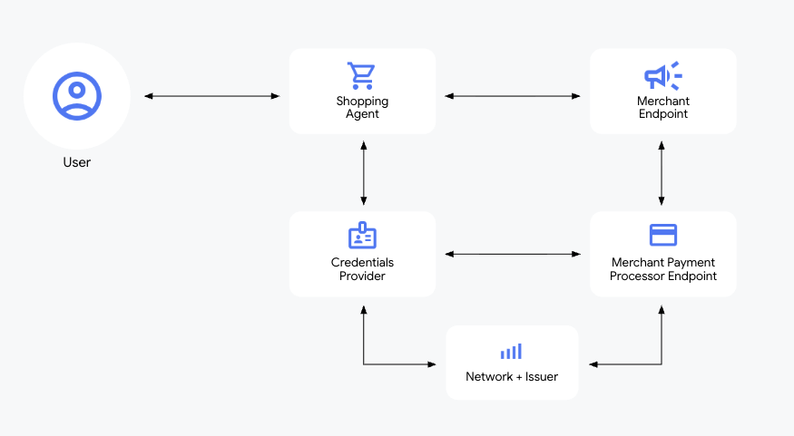
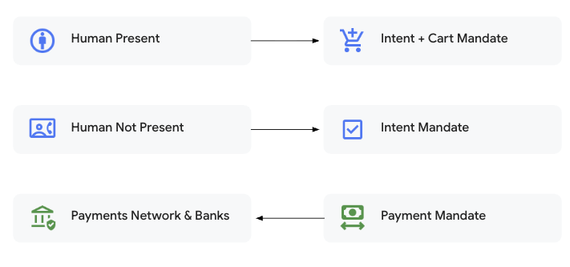

# Agent Payments Protocol (AP2)

[Agent Payments Protocol (AP2)](https://github.com/google-agentic-commerce/AP2) is an open protocol by Google 
for handling payments in agentic applications. The protocol is available as an extension for the Agent2Agent Protocl 
(A2A) and Universal Commerce Protocol (UCP).

It tries to tackle the following challenges in agentic payments:

* **Authorization**: How do you verify that the user gave the agent permission for a specific purchase?
* **Authenticity**: How can a marchant or payment processor verify that an agent's request reflects the user's intent?
* **Agent Errors**: How does the system protect against agent errors, e.g. hallucinations?
* **Accountability**: If a fradulent or incorrect transaction orccurs, who is responsible? 

## Roles

AP2 defines a role based architecture with the following roles.

* **Shopping Agent (SA)**: The primary agent for product discovery, building checkout, and executing purchase.
* **Credentials Provider (CP)**: CP is the source of payment credentials for the purchase. CP is responsible for 
    verifying that the agent is authorized to access this payment credential.
* **Merchant (M)**: M is the source of the checkout. Responsible for owning the catalog and fulfilling orders.
* **Merchant Payment Processor (MPP)**: MPP is responsible for processing payments by verifying that the payment credential
    has been authorized to pay for this checkout.
* **Trusted Surface (TS)**: TS is a UI surface that is trusted to get user consent for an intent before creating a user-signed mandate.
* **Network and Issuer (NI)**: The provider of the payment network and issuer of payment credentials to the human user.

## Verifiable Credentials / Mandates

The core principle of AP2 is "Verifiable Intent, Not Inferred Action." This replaces LLM guesswork with tamper-proof, 
cryptographically signed digital contracts called Verifiable Credentials or Mandates. 

There are 3 different mandates:

| Mandate Type | Function |
| --- | --- |
| **Cart Mandate** | Captures the cart as it is confirmed by the user. |
| **Intent Mandate** | Captures the conditions where an agent is authorized to buy something in the user's absence. |
| **Payment Mandate** | A separate credential for the payment network and banks to get visibility into the transaction. It signals that an AI agent was involved and whether it's a Human Present or Human not Present transaction. |

## Modes: Human Present vs. Human not Present

There are two flows in AP2: Human Present and Human Not Present.

### Human Present

In Human Present scenario, the user directly approves the Cart Mandate.

1. **User** -> **Shopping Agent**: "Find me new white running shoes"
2. **Shopping Agent**: capture the request in an initial `IntentMandate`. 
3. **Shopping Agent** -> **Merchant**: find shoes with `IntentMandate`; get some candidates.
4. **Shopping Agent** -> **User**: present a cart (Trusted Surface) with the shoes users would like.
5. **User**: select the shoe and approve the purchase.
6. **Agent**: sign a `CartMandate` to create an unchangeable record of the exact items and price.
7. **Agent** -> **Merchant Agent & Credential Provider Agent**: complete payment with a `PaymentMandate`.

See the detailed flow here: [Human Present Scenario](https://arthurchiao.art/assets/img/ap2-illustrated-guide/ap2-human-present.png)

### Human Not Present

In Human Not Present scenario, the User approves an Intent Mandate and the agent, acting autonomously, signs a Cart Mandate.

1. **User** -> **Shopping Agent**: "Buy concert tickets the moment they go on sale".
2. **Shopping Agent**: The user signs a detailed `IntentMandate` upfront. This mandate specifies the rules of engagement—price limits, timing, and other conditions.
3. **Shopping Agent** -> **Merchant & Credential Provider**: automatically generate a `CartMandate` on behalf of user once the precise conditions are met.

See the detailed flow here: [Human Not Present Scenario](https://arthurchiao.art/blog/ap2-illustrated-guide/#222-delegated-tasks-human-not-present)

## Steps

Follow these steps run some demos:

* [Agent Payments Protocol Sample: Human Present Purchases with a Card](https://github.com/google-agentic-commerce/AP2/tree/main/code/samples/python/scenarios/a2a/human-present/cards)
* [Agent Payments Protocol Sample: Human Not Present Purchases with a Card](https://github.com/google-agentic-commerce/AP2/blob/main/code/samples/python/scenarios/a2a/human-not-present/cards/)

## References

* [GitHub: AP2](https://github.com/google-agentic-commerce/AP2)
* [GitHub: AP2 spec](https://github.com/google-agentic-commerce/AP2/blob/main/docs/ap2/specification.md)
* [Official docs: AP2 - Agent Payments Protocol Documentation](https://ap2-protocol.org/)
* [A2A Protocol / AP2 protocol](https://a2aprotocol.ai/ap2-protocol)
* [AP2 Protocol](https://ap2-protocol.net/)
* [Blog: Powering AI commerce with the new Agent Payments Protocol (AP2)](https://cloud.google.com/blog/products/ai-machine-learning/announcing-agents-to-payments-ap2-protocol)
* [Blog: An Illustrated Guide to AP2 (Agent Payment Protocol)](https://arthurchiao.art/blog/ap2-illustrated-guide/)
* [YouTube: Intro to Google Agent Payments Protocol (AP2)](https://youtu.be/yLTp3ic2j5c)
* [YouTube: Agent payments, can you do my shopping? | The Agent Factory Podcast](https://youtu.be/T1MtWnEYXM0)
* [Codelab: Building Trustworthy Charity Agents with Google ADK and AP2](https://codelabs.developers.google.com/adk-ap2-charity-agents/instructions)
* [Codelab: Secure Agent Commerce with AP2 and UCP](https://codelabs.developers.google.com/next26/adk-agent-commerce)