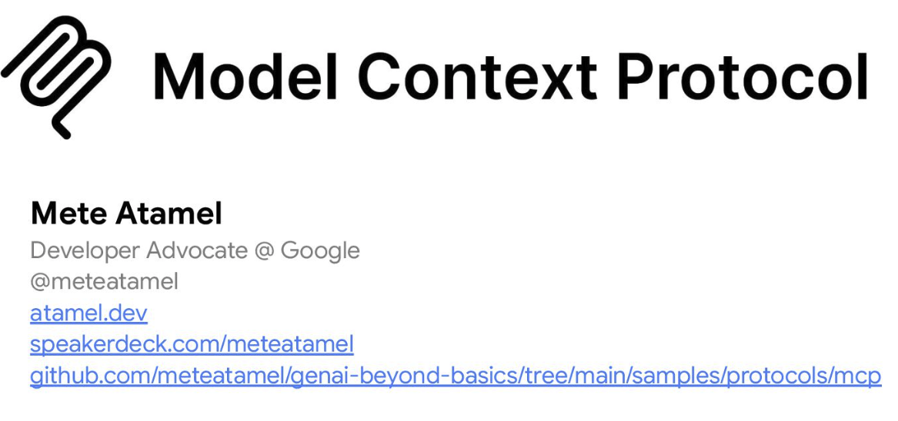

# Model Context Protocol (MCP)

## Overview

[Model Context Protocol](https://modelcontextprotocol.io/) (MCP) is an open protocol from Anthropic that standardizes
how models and agents access external tools and resources.

It has 3 distinct parts:

| Building Block | Who controls it?                                        | Use Cases                                                                            |
|:---------------|:--------------------------------------------------------|:-------------------------------------------------------------------------------------|
| **Tools**      | **Model-controlled:** Model decides when to call these  | Allow LLM to interact with external systems                                          |
| **Resources**  | **App-controlled:** App decides when to call these      | Provide read-only access to data for the LLM or client application.                  |
| **Prompts**    | **User-controlled:** The user decides when to use these | Reusable message templates that help LLMs generate structured, purposeful responses. |

## Steps

Follow these steps to learn about MCP:

* [Use an existing MCP server](./use-existing-mcp/)
* [Create a local MCP server](./create-local-mcp/)
* [Deploy MCP server to Cloud Run](./deploy-mcp-to-cloudrun/)
* [Document MCP server with tools, resources, prompt](./document-server)
* [Elicitation](./elicitation/)

> [!NOTE]
>
> The MCP Python SDK used in the code samples on https://modelcontextprotocol.io uses outdated `FastMCP 1.0`.
> Instead, you should use `FastMCP 2.0` from here: https://gofastmcp.com/. You can tell if you're using the right one in the code as follows:
>
> `from mcp.server import FastMCP` ==> This is FastMCP 1.0: DO NOT USE
>
> `from fastmcp import FastMCP` ==> This is FastMCP 2.0: USE THIS ONE
>
> There's different levels of MCP support in various tools. For example:
>
> * **MCP inspector** supports both stdio and HTTP transport. It supports MCP tools, resources, resource templates, and prompts.
> * **Claude Desktop** supports only stdio but not HTTP transport. It supports MCP tools, resources, prompts but not resource templates.
> * **Gemini CLI** supports both stdio and HTTP transport. It supports MCP tools and prompts but not resources or resource templates.
> * **ADK** supports both stdio and HTTP transport. It supports MCP tools only.

## Slides

There's a [presentation](https://speakerdeck.com/meteatamel/model-context-protocol) that accompanies the tutorial.

## References

* [Model Context Protocol](https://modelcontextprotocol.io/)
* [Course: Introduction to Model Context Protocol](https://anthropic.skilljar.com/introduction-to-model-context-protocol)
* [Course: Model Context Protocol: Advanced Topics](https://anthropic.skilljar.com/model-context-protocol-advanced-topics)
* [Blog: MCP Explained (blog series)](https://medium.com/@laurentkubaski/mcp-explained-45312250b161)
* [Blog: Gemini CLI Tutorial Series — Part 8: Building your own MCP Server](https://medium.com/google-cloud/gemini-cli-tutorial-series-part-8-building-your-own-mcp-server-74d6add81cca)
* [Docs: FastMCP](https://gofastmcp.com/getting-started/welcome)
* [Docs: ADK MCP](https://google.github.io/adk-docs/mcp/)
* [Codelab: Getting Started with MCP, ADK and A2A](https://codelabs.developers.google.com/codelabs/currency-agent)
* [Codelab: How to deploy a secure MCP server on Cloud Run](https://codelabs.developers.google.com/codelabs/cloud-run/how-to-deploy-a-secure-mcp-server-on-cloud-run)
* [Video: Why Everyone’s Talking About MCP?](https://youtu.be/_d0duu3dED4)
* [Python SDK code snippets](https://github.com/modelcontextprotocol/python-sdk/tree/main/examples/snippets)