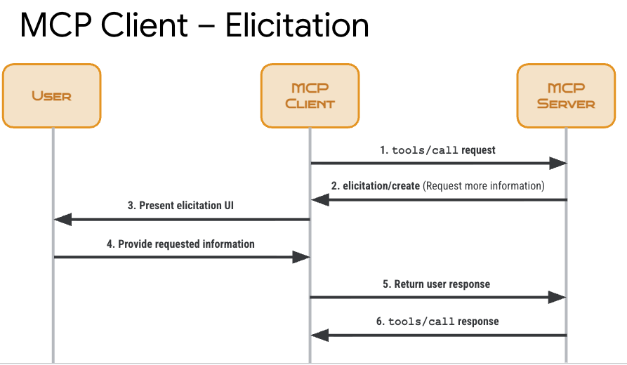

# Elicitation

Elicitation enables MCP servers to pause execution and request specific information from users via MCP clients.

This is particularly useful for:

* **Missing parameters**: Ask for required information not provided initially
* **Clarification requests**: Get user confirmation or choices for ambiguous scenarios
* **Progressive disclosure**: Collect complex information step-by-step
* **Dynamic workflows**: Adapt tool behavior based on user responses



See [client.py](./client.py) and [server.py](./server.py) on how you can implement elicitation for various scenarios.

## Test elicitation

Create a Python env and install FastMCP:

```shell
python -m venv .venv
source .venv/bin/activate
pip install fastmcp
```

Start the server:

```shell
python server.py
```

Run the client:

```shell
python client.py
```

Choose different tools and see how elicitation works:

```shell
Available tools:
1. approve_action
2. approve_action_with_match
3. greet_user
4. set_priority
5. collect_user_info
6. plan_meeting

Select a tool:
```

## References

* [MCP Protocol - Elicitation](https://modelcontextprotocol.io/specification/draft/client/elicitation)
* [FastMCP - Server Elicitation](https://gofastmcp.com/servers/elicitation)
* [FastMCP - Client Elicitation](https://gofastmcp.com/clients/elicitation)