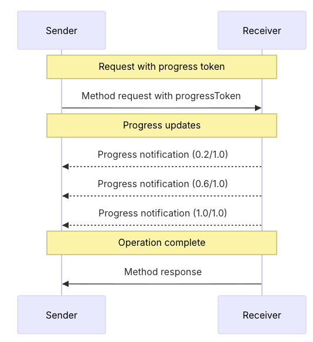

# Progress Reporting and Monitoring

MCP supports optional progress reporting from MCP servers and progress tracking from MCP clients for long-running
operations.



See [client.py](./client.py) and [server.py](./server.py) on how you can implement progress.

## Test progress

Create a Python env and install FastMCP and Gemini SDK:

```shell
python -m venv .venv
source .venv/bin/activate
pip install fastmcp
```

Start the server:

```shell
python server.py
```

Run the client:

```shell
python client.py
```

Choose different tools and see how progress works:

```shell
Available tools:
1. process_items
2. download_file
3. scan_directory

Select a tool:
```

## References

* [MCP Protocol - Progress](https://modelcontextprotocol.io/specification/draft/basic/utilities/progress)
* [FastMCP - Server Progress Handling](https://gofastmcp.com/servers/progress)
* [FastMCP - Client Progress Handling](https://gofastmcp.com/clients/progress)
