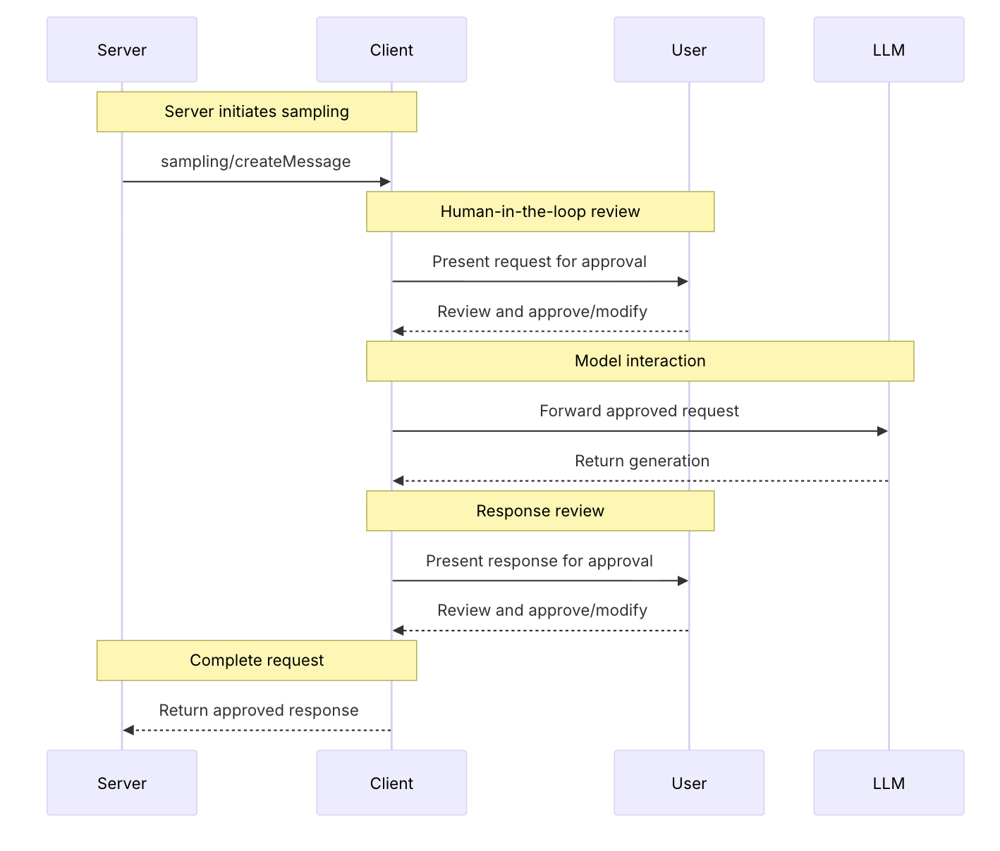

# Sampling

Allows the MCP server to make LLM calls through the MCP client on its behalf. Shifts the responsibility LLM calls from
the server to the client. This is useful for having user control in the middle and each client paying for its own LLM
usage.



See [client.py](./client.py) and [server.py](./server.py) on how you can implement elicitation for various scenarios.

## Test sampling

Create a Python env and install FastMCP and Gemini SDK:

```shell
python -m venv .venv
source .venv/bin/activate
pip install fastmcp google-genai
```

Start the server:

```shell
python server.py
```

Before running the client, make sure you point to your Google Cloud project id:

```python
    client = Client(vertexai=True,
                    project="your-project-id",
                    location="global")
```

Run the client:

```shell
python client.py
```

Choose different tools and see how sampling works:

```shell
Available tools:
1. generate_summary
2. generate_code

Select a tool:
```

## References

* [MCP Protocol - Sampling](https://modelcontextprotocol.io/specification/draft/client/sampling)
* [FastMCP - Server Sampling](https://gofastmcp.com/servers/sampling)
* [FastMCP - Client Sampling](https://gofastmcp.com/clients/sampling)
