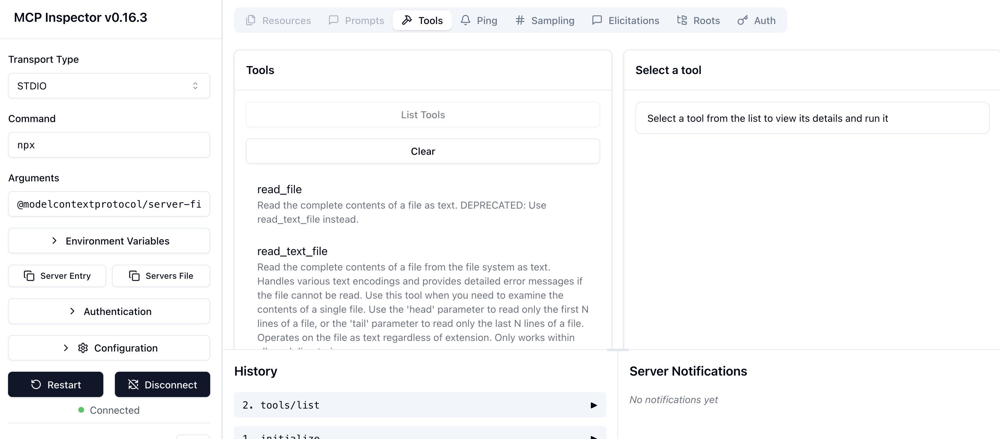

# Use an existing MCP server

Before building our own MCP servers, let's first use an existing server.

There are [reference MCP servers](https://github.com/modelcontextprotocol/servers) that one can run locally and have
developer tools like MCP Inspector or Gemini CLI or apps like Claude Desktop can use as tools.

For example, [Filesystem MCP Server](https://github.com/modelcontextprotocol/servers/tree/main/src/filesystem) is a
Node.js server implementing Model Context Protocol (MCP) for filesystem operations.

## MCP Inspector

The [MCP Inspector](https://modelcontextprotocol.io/legacy/tools/inspector) is an interactive developer tool for testing
and debugging MCP servers.

Run the filesystem MCP server with the MCP inspector:

```shell
npx -y @modelcontextprotocol/inspector npx @modelcontextprotocol/server-filesystem /Users/atamel/Desktop
```

> [!TIP]
> Sometimes, you might get an MCP inspector running in the background from a previous run. If you get a
> ` ❌  Proxy Server PORT IS IN USE at port 6277 ❌ ` kind of error, find the process holding the port and kill it:
> `lsof -i :6277` => to find the process number
> `kill -9 23876` = to kill the process

Once you `Connect` and then `List Tools`, you should see the available tools and exercise them.



## Claude Desktop

This [quickstart](https://modelcontextprotocol.io/quickstart/user) shows how to setup and use the filesystem MCP server
from Claude Desktop and enable it to access the filesystem. You can try prompts like `Can you write a poem and save it to my desktop?`
to see how it works.

## Gemini CLI

[Gemini CLI](https://github.com/google-gemini/gemini-cli) an open-source AI agent that brings the power of Gemini into
your terminal. It also has [MCP support](https://github.com/google-gemini/gemini-cli/blob/main/docs/tools/mcp-server.md).

Once you [install](https://github.com/google-gemini/gemini-cli/?tab=readme-ov-file#quick-install) Gemini CLI, create
a Install Gemini CLI:

You can configure MCP servers at the global level in the `~/.gemini/settings.json` file or in your project's root directory
in [`.gemini/settings.json`](./gemini/settings.json) file. In that file, you can configure the MCP server:

```shell
{
  "mcpServers": {
    "filesystem": {
      "command": "npx",
      "args": [
        "-y",
        "@modelcontextprotocol/server-filesystem",
        "/Users/atamel/Desktop",
        "/Users/atamel/Downloads"
      ]
    }
  }
}
```

Now, when you start Gemini CLI, you can simply do `/mcp list` and see the filesystem server:

```shell
ℹ Configured MCP servers:

  🟢 filesystem - Ready (14 tools)
    Tools:
    - create_directory
    - directory_tree
    - edit_file
    - get_file_info
    - list_allowed_directories
    - filesystem__list_directory
    - list_directory_with_sizes
    - move_file
    - filesystem__read_file
    - read_media_file
    - read_multiple_files
    - read_text_file
    - search_files
    - filesystem__write_file
```

You can then try the following prompt to see if Gemini CLI uses the filesystem server: `Can you create a directory named mcp-gemini?`

## Agent Development Kit (ADK)

[ADK](https://google.github.io/adk-docs/) is an agent framework from Google. You can also use MCP servers from ADK. Let's
see how you can use the filesystem server from ADK.

Create a Python env and install ADK:

```shell
python -m venv .venv
source .venv/bin/activate
pip install google-adk
```

Take a look at [`filesystem_assistant`](./filesystem_assistant/). It's a minimal agent configured with filesystem MCP server. Adjust the `TARGET_FOLDER_PATH` in the [`agent.py`](./filesystem_assistant/agent.py) and also rename `dotenv`
to `.env` and update with your API keys or projects.

You can now test the agent:

```shell
adk run filesystem_assistant

[user]: Can you create a poem and save as poem.txt?
Secure MCP Filesystem Server running on stdio
Client does not support MCP Roots, using allowed directories set from server args: [ '/Users/atamel/Desktop' ]
[filesystem_assistant_agent]: OK. I've created a file named poem.txt on your desktop with the content:

I am a file system agent
I can help you manage your files
I can create, read, and write files
I am a very useful agent
```
