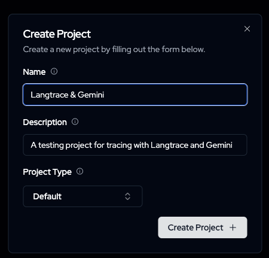
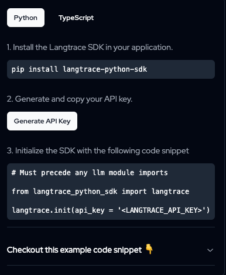
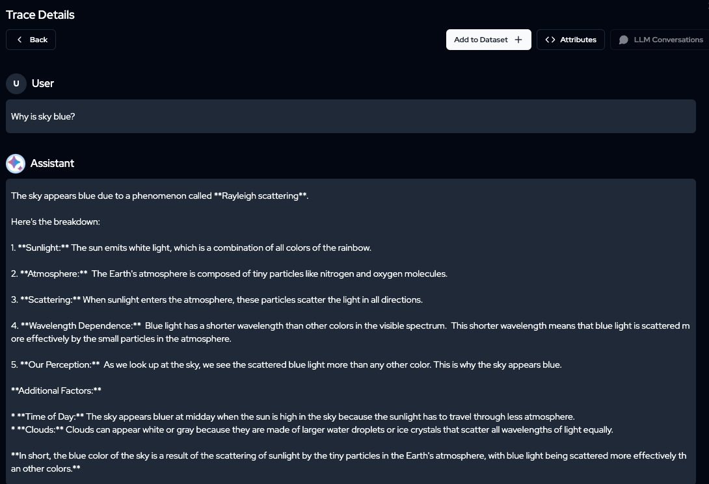
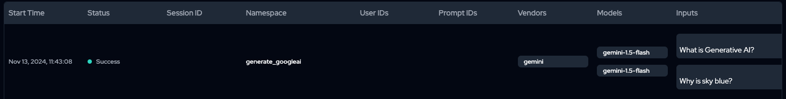
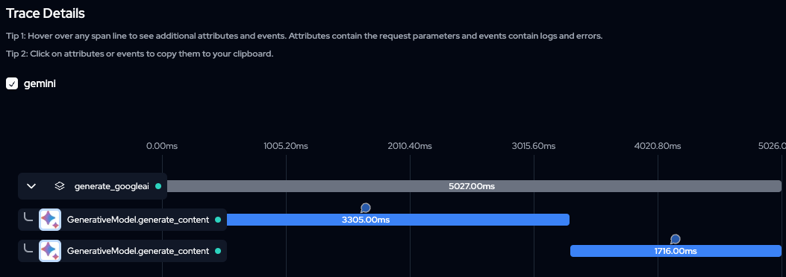
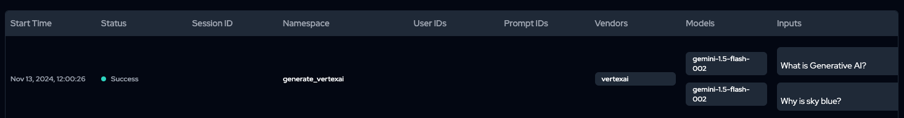
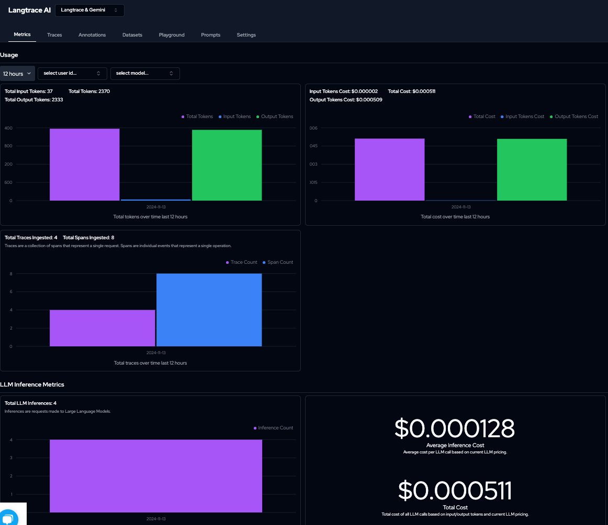

# Tracing with Langtrace and Gemini


[Langtrace](https://www.langtrace.ai/) is an open-source observability tool that collects and analyze traces in order to help you improve your
LLM apps. It has an SDK to collect traces from LLM APIs, Vector Databases and LLM based Frameworks. The traces are 
[open telemetry](https://opentelemetry.io/) compatible and can be exported to Langtrace or any other observability stack (Grafana, Datadog, 
Honeycomb etc). There's also a web-based Langtrace Dashboard where you can view and analyze your traces.


In this tutorial, you'll learn how to trace with Langtrace and Gemini on Google AI and Vertex AI. All the code is in
[main.py](main.py).

## Setup

First, signup for [Langtrace](https://langtrace.ai/) and create a project:



Then, create an API key:



Set it to an environment variable: 

```shell
export LANGTRACE_API_KEY=your-langtrace-api-key
```

It's also a good idea to create a Python virtual environment:

```shell
python -m venv .venv
source .venv/bin/activate
```

Install Langtrace:

```shell
pip install langtrace-python-sdk
```

## Langtrace and Gemini on Google AI

Let's look at how to trace LLM calls with Langtrace and Gemini running on Google AI. 

First, get an [API key for Gemini](https://aistudio.google.com/app/apikey) and set it to an environment variable:

```shell
export GEMINI_API_KEY=your-gemini-api-key
```

Install Google AI Python SDK for the Gemini:

```shell
pip install google-generativeai
```

Now, you can initialize Langtrace and Gemini:

```python
import os
from langtrace_python_sdk import langtrace  # Must precede any llm module imports
import google.generativeai as genai

langtrace.init(api_key=os.environ["LANGTRACE_API_KEY"])

model = genai.GenerativeModel("gemini-1.5-flash")
genai.configure(api_key=os.environ["GEMINI_API_KEY"])
```

And generate some content with Gemini on Google AI:

```python
def generate_googleai_1():
    response = model.generate_content("What is Generative AI?")
    print(response.text)

    response = model.generate_content("Why is sky blue?")
    print(response.text)
```

Run it:

```shell
python main.py generate_googleai_1
```

In a few seconds, you'll see traces for two LLM calls:


You can also see more details within each trace:



## Grouping traces

In the previous example, the two traces for two LLM calls were displayed individually. Sometimes, it's useful to group
similar calls in the same trace. You can do that by with `@with_langtrace_root_span`:

```python
@with_langtrace_root_span("generate_googleai")
def generate_googleai_2():
    response = model.generate_content("What is Generative AI?")
    print(response.text)

    response = model.generate_content("Why is sky blue?")
    print(response.text)
```

Run it:

```shell
python main.py generate_googleai_2
```

You'll now see traces grouped together:



You can also see more details within each trace:



## Langtrace and Gemini on Vertex AI

You can do everything I explained with Gemini on Vertex AI as well. Let's take a quick look how.

Make sure your `gcloud` is set up with your Google Cloud project and it is set as an environment variable:

```shell
gcloud config set core/project your-google-cloud-project-id
export GOOGLE_CLOUD_PROJECT_ID=your-google-cloud-project-id
```

You're logged in:

```shell
gcloud auth application-default login
```

Install Google Vertex AI Python SDK for the Gemini:

```shell
pip install google-cloud-aiplatform
```

Now, generate some content with Gemini on Vertex AI:

```python
@with_langtrace_root_span("generate_vertexai")
def generate_vertexai():
    vertexai.init(project=os.environ["GOOGLE_CLOUD_PROJECT_ID"], location="us-central1")
    model = GenerativeModel("gemini-1.5-flash-002")

    response = model.generate_content("What is Generative AI?")
    print(response.text)

    response = model.generate_content("Why is sky blue?")
    print(response.text)
```

Run it:

```shell
python main.py generate_vertexai
```

In a few seconds, you'll see traces for the two LLM calls:



Nice!

## Metrics

Last but not least, after sending traces, if you switch to Metrics tab, you can see some metrics on token counts, costs,
and more:



## References

* [Langtrace](https://www.langtrace.ai/)
* [Langtrace GitHub](https://github.com/Scale3-Labs/langtrace)
* [Langtrace Gemini](https://docs.langtrace.ai/supported-integrations/llm-tools/gemini)